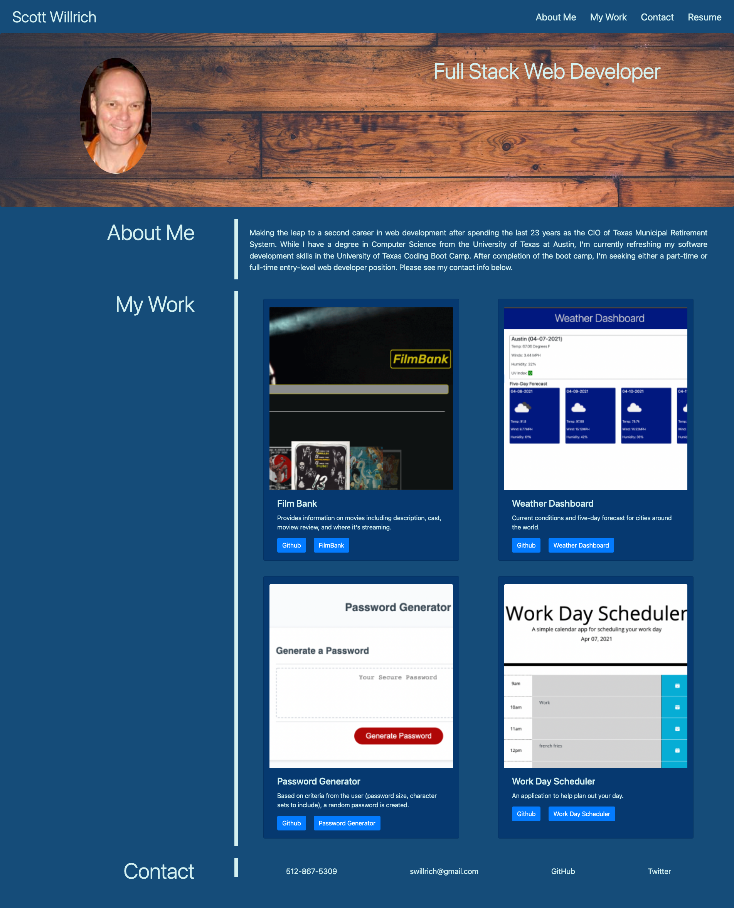

# scottwillrich

scottwillrich is an application that hosts my portfolio (Scott Willrich)

## Deployed Application
https://swillrich5.github.io/scottwillrich

## GitHub

https://github.com/swillrich5/scottwillrich

## User Story
```
AS AN employer
I WANT to view a potential employee's deployed portfolio of work samples
SO THAT I can review samples of their work and assess whether they're a good candidate for an open position
```
## Update Portfolio Requirements

* Name
* Recent photo
* Links to sections about my backgound, coding accomplishments, and contact information.
* The aformention links, when clicked, will scroll the user to the corresponding section of the porfolio.
* The portfolio should be updated to include links to the recently completed project as well as other, successul applications.
* Links to GitHub repositories and teh deployed application are provided.
* The page resizes as appropriate for devices with differeent screen sizes (PCs, tables, smartphones).  In other words, the page is responsive.

---

## Image of Deployed Application



---

## Technology Used

* HTML
* CSS 
* Bootstrap

---
